# Elasticsearch Agent Builder Hackathon Strategy for Omega

## 📋 Executive Summary

**Hackathon**: [Elasticsearch Agent Builder Hackathon](https://elasticsearch.devpost.com/)  
**Deadline**: February 27, 2026 at 1:00pm EST  
**Total Prize Pool**: $20,000 in cash + blog features

Your project **Zapfeed** (AI-powered customer feedback collection and analysis) is a **strong candidate**, but needs significant enhancements to compete for 1st place.

---

## 🎯 Hackathon Requirements Checklist

### Mandatory Requirements

| Requirement                                         | Status                  | Action Needed                                        |
| --------------------------------------------------- | ----------------------- | ---------------------------------------------------- |
| Use **Elastic Agent Builder**                       | ❌ Not implemented      | **CRITICAL**: Must integrate Agent Builder framework |
| Multi-step AI agents                                | ⚠️ Partial (basic chat) | Enhance with multi-agent orchestration               |
| Use Agent Builder Tools (Workflows, Search, ES\|QL) | ❌ Not implemented      | Add Elasticsearch-native tools                       |
| ~400 word description                               | ❌ Not created          | Write compelling project narrative                   |
| 3-minute demo video                                 | ❌ Not created          | Record polished demonstration                        |
| Open source with OSI license                        | ⚠️ Need to verify       | Ensure proper license                                |
| Social sharing (+10% bonus)                         | ❌ Not done             | Post on X tagging @elastic_devs                      |

---

## 📊 Judging Criteria Analysis

| Criteria                          | Weight | Current State              | Target                                |
| --------------------------------- | ------ | -------------------------- | ------------------------------------- |
| **Technical Execution**           | 30%    | 3/10 - Basic TiDB + OpenAI | 9/10 - Full Agent Builder integration |
| **Potential Impact & Wow Factor** | 30%    | 5/10 - Useful but common   | 9/10 - Unique multi-agent system      |
| **Demo Quality**                  | 30%    | 0/10 - No video            | 9/10 - Professional, clear demo       |
| **Social Sharing**                | 10%    | 0/10                       | 10/10 - Easy points                   |

---

## 🏆 Learnings from TiDB Hackathon Winners

### 1. AutoIR (3rd Place) - Key Patterns

- **Agentic architecture**: LLM orchestrator with multiple safe tools
- **Clear tooling**: `tidb_query` (SELECT-only SQL), `analysis` (expression evaluator)
- **Safety rails**: Enforced SELECT-only with automatic LIMIT
- **Real-world problem**: Incident response automation
- **Explainable AI**: Transparent reasoning and evidence

### 2. PetFit AI (Winner) - Key Patterns

- **Multi-agent system**: 6+ specialized sub-agents (symptom, audio, skin, vitals, report)
- **Deep database integration**: Vector search, Chat2Query API, TTL, Kafka streaming
- **Multiple input types**: Text, audio, images, real-time vitals
- **Hybrid search**: Full-text + semantic search combined
- **Google ADK**: Used Google's Agent Development Kit for orchestration

### 3. HeyDesk (Winner) - Key Patterns

- **Custom SDK development**: Built a complete SDK from scratch (HUGE differentiator)
- **Enterprise features**: Multi-tenancy, real-time SignalR, intelligent routing
- **True agentic workflow**: Multi-step combining vector + full-text + LLM reasoning
- **Production-ready**: Docker, health checks, security features

---

## 🚀 Recommended Feature Enhancements for Zapfeed

### **Phase 1: Core Elasticsearch Migration** (MANDATORY)

Replace TiDB with Elasticsearch and integrate Agent Builder:

#### 1.1 Replace TiDB → Elasticsearch

Current:

```typescript
// TiDB vector search
const relateds = await prisma.$queryRawUnsafe<any[]>(
  `SELECT id, content, vec_cosine_distance(embedding, '[${vectorData}]') AS distance 
   FROM EmbeddedDocument ORDER BY distance LIMIT 40`,
);
```

Target: Use Elasticsearch with vector search + full-text hybrid search

#### 1.2 Implement Agent Builder Framework

- Install and configure Elastic Agent Builder
- Create custom tools using ES\|QL for feedback analysis
- Use Elastic Workflows for multi-step feedback processing

---

### **Phase 2: Multi-Agent Architecture** (Inspired by Winners)

Create a sophisticated multi-agent system for feedback analysis:

```
                    ┌─────────────────────┐
                    │   Main Orchestrator │
                    │   (zapfeed_agent)   │
                    └──────────┬──────────┘
           ┌───────────────────┼───────────────────┐
           ▼                   ▼                   ▼
┌──────────────────┐ ┌──────────────────┐ ┌──────────────────┐
│ sentiment_agent  │ │ insight_agent    │ │ action_agent     │
│ ─────────────────│ │ ─────────────────│ │ ─────────────────│
│ • Analyze tone   │ │ • Find patterns  │ │ • Generate tasks │
│ • Emotion detect │ │ • Trend analysis │ │ • Auto-respond   │
│ • Classify type  │ │ • Anomaly detect │ │ • Create tickets │
└──────────────────┘ └──────────────────┘ └──────────────────┘
```

#### Proposed Agents & Tools

| Agent                         | Purpose                          | Elasticsearch Tools                     |
| ----------------------------- | -------------------------------- | --------------------------------------- |
| `sentiment_analysis_agent`    | Deep sentiment understanding     | ES\|QL aggregations, ML inference       |
| `trend_detection_agent`       | Identify patterns over time      | Time-series analysis, anomaly detection |
| `competitor_comparison_agent` | Compare with industry benchmarks | Full-text search on benchmark data      |
| `action_recommendation_agent` | Suggest business actions         | Elasticsearch Workflows                 |
| `customer_segmentation_agent` | Cluster customers by behavior    | Vector clustering                       |
| `response_generation_agent`   | Auto-draft customer responses    | RAG with Elasticsearch                  |

---

### **Phase 3: Standout Features** (For Wow Factor)

#### 3.1 Real-time Feedback Streaming (Inspired by PetFit)

- Use Elasticsearch's data streaming capabilities
- Live dashboard updates as feedback comes in
- Real-time anomaly alerts

#### 3.2 Multi-modal Feedback Analysis (Unique Differentiator)

- **Text**: Current capability enhanced with Elasticsearch
- **Voice feedback**: Transcription → sentiment analysis
- **Screenshot/Image feedback**: Visual issue detection
- **Video testimonials**: Key moment extraction

#### 3.3 Custom Elasticsearch SDK/Tools (Inspired by HeyDesk)

Create reusable Agent Builder tools that others can use:

- `feedback_search_tool` - Hybrid search for feedback
- `sentiment_aggregate_tool` - Aggregate sentiment by period
- `trend_alert_tool` - Detect emerging trends

#### 3.4 Intelligent Feedback Routing (Agentic Workflow)

```mermaid
graph TD
    A[New Feedback] --> B{Sentiment Analysis}
    B -->|Negative| C[Urgent Queue]
    B -->|Neutral| D[Standard Queue]
    B -->|Positive| E[Testimonial Collection]
    C --> F{Category Detection}
    F -->|Bug| G[Dev Team Ticket]
    F -->|Support| H[Support Agent]
    F -->|Feature| I[Product Backlog]
```



---

## 📝 Submission Checklist

### Description (~400 words) - Key Points to Cover

1. **Problem**: Businesses struggle to extract actionable insights from customer feedback
2. **Solution**: AI-powered multi-agent system using Elasticsearch Agent Builder
3. **Technical Innovation**:
   - Multi-agent architecture with specialized analysis agents
   - Hybrid search (vector + full-text) for context-aware responses
   - ES\|QL for complex feedback analytics
   - Elasticsearch Workflows for automated actions
4. **Features Used**: Highlight 2-3 Agent Builder features you liked
5. **Challenges**: Mention implementation hurdles overcome

### Demo Video (3 minutes) - Suggested Structure

| Time      | Content                                      |
| --------- | -------------------------------------------- |
| 0:00-0:30 | Problem statement & solution overview        |
| 0:30-1:30 | Live demo of multi-agent feedback analysis   |
| 1:30-2:15 | Show Elasticsearch Agent Builder integration |
| 2:15-2:45 | Demonstrate workflow automation              |
| 2:45-3:00 | Impact metrics & future vision               |

### Social Sharing (+10% bonus)

Post on X/Twitter:

```
🚀 Just submitted Zapfeed to the @elastic Agent Builder Hackathon!

Built a multi-agent AI system for customer feedback analysis using:
• Elastic Agent Builder for orchestration
• ES\|QL for analytics
• Vector + full-text hybrid search

Check it out: [link] #ElasticAgentBuilder @elastic_devs
```

---

## 🗓️ Recommended Implementation Timeline

| Phase      | Duration | Tasks                                              |
| ---------- | -------- | -------------------------------------------------- |
| **Week 1** | 3-4 days | Replace TiDB → Elasticsearch, set up Agent Builder |
| **Week 2** | 4-5 days | Implement multi-agent architecture                 |
| **Week 3** | 3-4 days | Add standout features, polish UI                   |
| **Week 4** | 2-3 days | Record demo video, write description, social posts |

---

## 🎯 Key Differentiators to Win

Based on winner patterns, focus on these to stand out:

1. **✅ Multi-Agent System** - Not just one LLM call, but orchestrated agents
2. **✅ Custom Tooling** - Create reusable Agent Builder tools
3. **✅ Hybrid Search** - Combine vector + full-text search
4. **✅ Real-world Impact** - Show tangible business value metrics
5. **✅ Production Quality** - Error handling, monitoring, documentation
6. **✅ Architecture Diagram** - Judges love clear technical diagrams
7. **✅ Social Proof** - Get that easy 10% bonus

---

## ⚠️ Current Gaps vs Winners

| Gap                            | Priority    | Effort   |
| ------------------------------ | ----------- | -------- |
| No Elasticsearch/Agent Builder | 🔴 CRITICAL | High     |
| Single agent, not multi-agent  | 🔴 HIGH     | Medium   |
| No custom SDK/tools            | 🟡 MEDIUM   | Medium   |
| No demo video                  | 🔴 CRITICAL | Low      |
| No social posts                | 🟢 LOW      | Very Low |

---

## 🔗 Resources to Get Started

1. [Elastic Agent Builder Docs](https://www.elastic.co/docs/explore-analyze/ai-features/elastic-agent-builder)
2. [Agent Builder Tools Reference](https://www.elastic.co/docs/explore-analyze/ai-features/agent-builder/tools)
3. [ES\|QL Query Language](https://www.elastic.co/guide/en/elasticsearch/reference/current/esql.html)
4. [Elasticsearch Vector Search](https://www.elastic.co/guide/en/elasticsearch/reference/current/dense-vector.html)
5. [Hackathon Resources Tab](https://elasticsearch.devpost.com/resources)

---

## 💡 Bottom Line: Can Zapfeed Win?

**Yes, with significant work.** Your current project has a solid foundation:

- ✅ Real-world use case (customer feedback)
- ✅ AI integration (OpenAI)
- ✅ Vector search capability
- ✅ Clean UI with Next.js

**But to win, you MUST:**

1. **Migrate to Elasticsearch** - This is non-negotiable
2. **Implement Agent Builder** - The hackathon is about Agent Builder
3. **Build multi-agent architecture** - All winners had this
4. **Create a polished demo** - 30% of your score
5. **Share on social** - Free 10% bonus.
