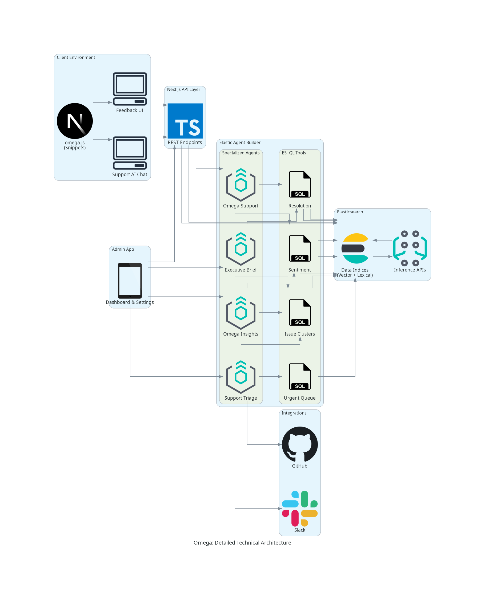

<p align="center">
  
</p>

# Omega

> **Unify customer feedback and support into one AI-powered platform. Collect, analyze, and respond, all backed by Elasticsearch.**

[](https://www.youtube.com/watch?v=29ulpLYsDjM)

## 🚨 The Problem

Businesses lose over **$75 billion a year** to poor customer service. Feedback sits unread in spreadsheets. Support agents copy-paste from outdated docs. When negative sentiment spikes, nobody connects it to what customers are actually asking in support chats — because feedback, chat, tickets, and analytics all live in different tools.

**Omega fixes this**: one platform, one data layer (Elasticsearch), one AI orchestration layer (Elastic Agent Builder) connecting feedback collection, customer support, and automated workflows.

## 🚀 What It Does

Omega is a dual-mode SaaS platform — **Feedback Analytics + AI Customer Support** — running entirely on Elasticsearch. Businesses embed a widget with 2 lines of code. The same widget handles feedback collection or AI support, configurable per team.

### Arya: AI Customer Support Agent
Customers chat with Arya through the embeddable widget. Under the hood:
- **Hybrid search** on `support_docs` using BM25 (lexical) + KNN (vector) with Reciprocal Rank Fusion (**RRF**, k=60).
- The `omega_customer_support` agent in **Elastic Agent Builder** generates grounded responses with inline [1], [2] citations mapped to actual source documents.
- **Auto-detects 6 languages** (English, Spanish, French, German, Hindi, Arabic) — queries are translated to English for search, responses translated back with citations preserved.
- A **confidence score** is computed from retrieval relevance (75%) and source coverage (25%).
- When confidence drops below 55%, or frustration is detected, the **Smart Escalation Workflow** fires: the `omega_smart_escalation` agent reads the conversation via ES|QL tools, classifies severity (**P0–P3**), creates a prioritized ticket, and sends a Slack alert.

### 📊 Feedback Analytics
Every feedback submission hits an ingest pipeline that **auto-extracts sentiment** (positive/neutral/negative) and generates vector embeddings at index time.
- The admin dashboard visualizes real-time sentiment trends, complaint clusters, and rating movement.
- All powered by **ES|QL aggregation queries**.

### 🤖 Admin AI Chat: 3 Specialized Agents
Product teams query feedback data in natural language. Omega auto-selects the right agent:
- **omega_insights**: Evidence-backed analysis with counts, percentages, and trend data.
- **omega_executive_brief**: Stakeholder-ready summaries with quantified business impact.
- **omega_support_triage**: Surfaces unresolved negative feedback with remediation proposals.

## ⚙️ 3 Automated Workflows

1. **Sentiment Spike Workflow** (Cron every 5 min): `omega_sentiment_spike_analyzer` compares metrics against a 1–24h baseline, classifies severity, and creates alerts.
2. **Smart Escalation Workflow**: Fires from Arya chat. Pulls conversation history via ES|QL, assigns priority, and routes to the correct team.
3. **Knowledge Gap Workflow**: `omega_knowledge_gap_detector` finds unanswered queries, clusters them, and recommends new articles.

## 🏗️ Architecture


### Technical Deep Dive


### Elasticsearch as the Complete Data Layer
All data lives across **8 indices**: `feedback`, `support_docs`, `support_conversations`, `support_tickets`, `issue_clusters`, `action_audit_log`, `teams`, `users`. **No secondary database.**

### Elastic Agent Builder: 7 Agents, 15 Custom ES|QL Tools
Agent logic is decoupled from application code. A sync script (`npm run sync:agent-builder`) pushes definitions to the Kibana API.

| # | Agent | Role |
|---|---|---|
| 1 | Insights Agent | Analyzes feedback trends with evidence |
| 2 | Executive Brief Agent | Board-ready summaries with business impact |
| 3 | Support Triage Agent | Urgent item identification and triage |
| 4 | Customer Support Agent (Arya) | Grounded answers with inline citations |
| 5 | Sentiment Spike Analyzer | Detects/classifies negative sentiment spikes |
| 6 | Smart Escalation Agent | Conversation-aware ticket routing (P0–P3) |
| 7 | Knowledge Gap Detector | Finds documentation gaps from unanswered queries |

### Arya's Search Pipeline
1. User message received, language auto-detected.
2. BM25 lexical + KNN vector searches fire in parallel on `support_docs`.
3. Results fused with **RRF** (k=60).
4. Top sources passed as context to `omega_customer_support` agent.
5. Response generated with citations and translated back to user's language.

### Knowledge Ingestion
Web URLs are crawled, PDFs parsed, content split into 1,200-character chunks with overlap, and indexed with vector embeddings via **Elastic inference endpoints**.

## 🛠️ Tech Stack

- **Framework**: Next.js 14, TypeScript
- **Search & Data**: Elasticsearch 8.x (Hybrid Search, Ingest Pipelines, ES|QL)
- **AI Orchestration**: Elastic Agent Builder (7 Agents, 15 ES|QL Tools)
- **UI & Analytics**: Radix UI, Recharts, Framer Motion, Tailwind CSS

---

## 🏁 Getting Started

### Prerequisites
- Node.js 18+
- [Elastic Cloud](https://cloud.elastic.co) deployment with Agent Builder enabled

### Installation
```bash
# 1. Clone the repository
git clone https://github.com/priyanshuharshbodhi1/omega.git
cd omega

# 2. Install dependencies
npm install

# 3. Set up environment variables
cp .env.example .env

# 4. Initialize Elasticsearch indices
npm run setup:elastic-feedback

# 5. Sync agents and tools to Agent Builder
npm run sync:agent-builder

# 6. Start development server
npm run dev
```

## 📜 License
MIT License. See [LICENSE](./LICENSE) for details.
