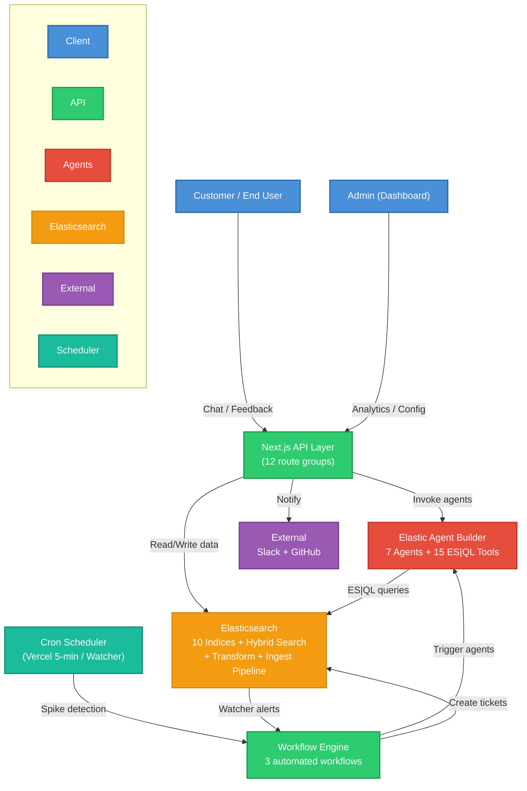

# Omega Architecture — Elasticsearch Agent Builder Hackathon

## High-Level Architecture

> How the system works at a glance. Colored by responsibility.

---

## Low-Level Architecture

> Full detail: every agent, tool, index, workflow, and data flow.

```mermaid
flowchart TB
  classDef clientNode fill:#4A90D9,stroke:#2E6BA6,color:#fff,stroke-width:1px,font-size:11px
  classDef apiNode fill:#2ECC71,stroke:#1B9E4B,color:#fff,stroke-width:1px,font-size:11px
  classDef agentNode fill:#E74C3C,stroke:#C0392B,color:#fff,stroke-width:1px,font-size:11px
  classDef toolNode fill:#E8A0A0,stroke:#C0392B,color:#1a1a1a,stroke-width:1px,font-size:10px
  classDef indexNode fill:#F5C842,stroke:#D4A012,color:#1a1a1a,stroke-width:1px,font-size:10px
  classDef infraNode fill:#F39C12,stroke:#D68910,color:#fff,stroke-width:1px,font-size:11px
  classDef extNode fill:#9B59B6,stroke:#7D3C98,color:#fff,stroke-width:1px,font-size:11px
  classDef cronNode fill:#1ABC9C,stroke:#148F77,color:#fff,stroke-width:1px,font-size:11px
  classDef wfNode fill:#17A589,stroke:#148F77,color:#fff,stroke-width:1px,font-size:11px

  %% ════════════════════════════════════════════
  %% CLIENT LAYER
  %% ════════════════════════════════════════════
  subgraph Clients["Clients"]
    direction LR
    CW["Embedded Widget\n(Feedback + Arya Chat)"]:::clientNode
    ADMIN["Admin Dashboard\n(Analytics + Config)"]:::clientNode
  end

  %% ════════════════════════════════════════════
  %% API LAYER
  %% ════════════════════════════════════════════
  subgraph APILayer["Next.js API Layer"]
    direction TB
    subgraph CoreAPIs["Core Endpoints"]
      FCOLLECT["/feedback/collect"]:::apiNode
      SCHAT["/support/chat\n+ auto lang detect\n+ hybrid search"]:::apiNode
      SIDX["/support/index-source"]:::apiNode
      SPDF["/support/index-pdf"]:::apiNode
      CHAT["/chat (admin insights)"]:::apiNode
      TKW["/team/:id/stats/top-keywords\n(significant_text agg)"]:::apiNode
    end
    subgraph Workflows["Automated Workflows"]
      WF1["/workflows/sentiment-spike"]:::wfNode
      WF2["/workflows/smart-escalation"]:::wfNode
      WF3["/workflows/knowledge-gap"]:::wfNode
    end
    subgraph Scheduler["Scheduler"]
      CRON["/cron/sentiment-check\n(Vercel cron 5min)"]:::cronNode
    end
    subgraph MgmtAPIs["Management Endpoints"]
      CLUST["/issue-clusters/*\n(recluster, verify, slack, github)"]:::apiNode
      TICK["/support/tickets"]:::apiNode
    end
  end

  %% ════════════════════════════════════════════
  %% AGENT BUILDER LAYER
  %% ════════════════════════════════════════════
  subgraph AgentBuilder["Elastic Agent Builder"]
    direction TB
    subgraph CoreAgents["Core Agents (4)"]
      AG1["omega_insights"]:::agentNode
      AG2["omega_executive_brief"]:::agentNode
      AG3["omega_support_triage"]:::agentNode
      AG4["omega_customer_support"]:::agentNode
    end
    subgraph WFAgents["Workflow Agents (3)"]
      AG5["omega_sentiment_spike_analyzer"]:::agentNode
      AG6["omega_smart_escalation"]:::agentNode
      AG7["omega_knowledge_gap_detector"]:::agentNode
    end
  end

  subgraph ESQLTools["15 ES|QL Tools"]
    direction TB
    subgraph AnalyticsTools["Analytics (6)"]
      T1["sentiment_trends"]:::toolNode
      T2["low_rating_examples"]:::toolNode
      T3["resolution_snapshot"]:::toolNode
      T4["issue_buckets"]:::toolNode
      T5["urgent_queue"]:::toolNode
      T6["issue_clusters"]:::toolNode
    end
    subgraph SpikeTools["Spike (3)"]
      T7["spike_recent_metrics"]:::toolNode
      T8["spike_baseline_metrics"]:::toolNode
      T9["spike_recent_complaints"]:::toolNode
    end
    subgraph EscTools["Escalation (2)"]
      T10["conversation_history"]:::toolNode
      T11["ticket_stats"]:::toolNode
    end
    subgraph GapTools["Knowledge Gap (2)"]
      T12["unanswered_queries"]:::toolNode
      T13["recent_user_queries"]:::toolNode
    end
    subgraph PlatTools["Platform (2)"]
      PT1["generate_esql"]:::toolNode
      PT2["execute_esql"]:::toolNode
    end
  end

  %% ════════════════════════════════════════════
  %% ELASTICSEARCH LAYER
  %% ════════════════════════════════════════════
  subgraph Elasticsearch["Elasticsearch"]
    direction TB
    subgraph Indices["10 Indices"]
      direction LR
      I1[("feedback")]:::indexNode
      I2[("teams")]:::indexNode
      I3[("support_docs")]:::indexNode
      I4[("support_conversations")]:::indexNode
      I5[("issue_clusters")]:::indexNode
      I6[("action_audit_log")]:::indexNode
      I7[("support_tickets")]:::indexNode
      I8[("users")]:::indexNode
      I9[("feedback_daily_stats")]:::indexNode
    end
    subgraph ESFeatures["ES Features"]
      direction LR
      HS["Hybrid Search\nBM25 + KNN\n+ RRF Fusion"]:::infraNode
      PL["Ingest Pipeline\nauto-embed on index"]:::infraNode
      TX["Continuous Transform\ndaily stats rollup"]:::infraNode
      WA["Watcher\nsentiment spike alert"]:::infraNode
      INF["Inference Endpoints\nembedding + completion"]:::infraNode
      SIG["significant_text\nagg for keywords"]:::infraNode
    end
  end

  %% ════════════════════════════════════════════
  %% EXTERNAL
  %% ════════════════════════════════════════════
  subgraph External["External Integrations"]
    SL["Slack"]:::extNode
    GH["GitHub Issues"]:::extNode
    VC["Vercel Cron"]:::extNode
  end

  %% ════════════════════════════════════════════
  %% CONNECTIONS
  %% ════════════════════════════════════════════

  %% Client → API
  CW -->|"feedback"| FCOLLECT
  CW -->|"chat msg"| SCHAT
  ADMIN --> CHAT
  ADMIN --> TKW
  ADMIN --> CLUST
  ADMIN --> TICK

  %% API → Agents
  CHAT --> AG1 & AG2 & AG3
  SCHAT --> AG4
  WF1 --> AG5
  WF2 --> AG6
  WF3 --> AG7

  %% Cron → Workflow
  VC --> CRON
  CRON --> WF1

  %% Agents → Tools
  AG1 --> T1 & T2 & T3 & T4 & T5 & T6 & PT1 & PT2
  AG2 --> T1 & T3 & T4 & T6 & PT1 & PT2
  AG3 --> T2 & T5 & T6 & PT1 & PT2
  AG4 --> PT1 & PT2
  AG5 --> T7 & T8 & T9
  AG6 --> T10 & T11
  AG7 --> T12 & T13

  %% Tools → Indices
  T1 & T2 & T3 & T4 & T5 --> I1
  T6 --> I5
  T7 & T8 & T9 --> I1
  T10 --> I4
  T11 --> I7
  T12 & T13 --> I4
  PT1 & PT2 --> I1

  %% API → ES
  FCOLLECT --> I1
  FCOLLECT --> PL
  SCHAT --> HS
  SCHAT --> I4
  HS --> I3
  SIDX --> I3
  SIDX --> INF
  SPDF --> I3
  TKW --> SIG
  SIG --> I1
  SIG --> I4

  %% ES Internal
  PL --> INF
  TX --> I1
  TX --> I9
  WA --> I1
  WA --> WF1

  %% External
  CLUST --> SL
  CLUST --> GH
```

---

## Summary Tables

### 7 Agents

| Agent | Purpose | Invoked By |
|---|---|---|
| `omega_insights` | Deep feedback analytics + ad-hoc ES\|QL | Admin Analysis Chat |
| `omega_executive_brief` | High-level team performance summary | Admin Analysis Chat |
| `omega_support_triage` | Prioritize urgent issues + queue | Admin Analysis Chat |
| `omega_customer_support` | Answer customer questions with citations | Arya Chat Widget |
| `omega_sentiment_spike_analyzer` | Analyze sudden negative sentiment spikes | Sentiment Spike Workflow |
| `omega_smart_escalation` | Decide ticket priority + auto-create | Smart Escalation Workflow |
| `omega_knowledge_gap_detector` | Find unanswered topics in conversations | Knowledge Gap Workflow |

### 15 ES|QL Tools

| # | Tool | Agent(s) | Queries |
|---|---|---|---|
| 1 | `omega_sentiment_trends` | insights, exec_brief | feedback |
| 2 | `omega_low_rating_examples` | insights, triage | feedback |
| 3 | `omega_resolution_snapshot` | insights, exec_brief | feedback |
| 4 | `omega_issue_buckets` | insights, exec_brief | feedback |
| 5 | `omega_urgent_queue` | insights, triage | feedback |
| 6 | `omega_issue_clusters` | insights, exec_brief, triage | issue_clusters |
| 7 | `omega_spike_recent_metrics` | spike_analyzer | feedback |
| 8 | `omega_spike_baseline_metrics` | spike_analyzer | feedback |
| 9 | `omega_spike_recent_complaints` | spike_analyzer | feedback |
| 10 | `omega_conversation_history` | smart_escalation | support_conversations |
| 11 | `omega_ticket_stats` | smart_escalation | support_tickets |
| 12 | `omega_unanswered_queries` | knowledge_gap | support_conversations |
| 13 | `omega_recent_user_queries` | knowledge_gap | support_conversations |
| 14 | `platform.core.generate_esql` | insights, exec_brief, triage, customer | any |
| 15 | `platform.core.execute_esql` | insights, exec_brief, triage, customer | any |

### 10 Elasticsearch Indices

| Index | Key Feature |
|---|---|
| `feedback` | Ingest pipeline (auto-embed), source for Transform + Watcher |
| `teams` | Team configuration |
| `support_docs` | Dense vectors + Hybrid Search (BM25 + KNN + RRF) |
| `support_conversations` | Chat history for escalation + gap detection |
| `issue_clusters` | Auto-reclustered complaint groups |
| `action_audit_log` | Audit trail for Slack/GitHub actions |
| `support_tickets` | Escalation tickets from workflows |
| `users` | User accounts |
| `feedback_daily_stats` | Populated by continuous Transform (1-min sync) |

### 3 Workflows + Cron

| Route | Trigger | Agent |
|---|---|---|
| `/api/workflows/sentiment-spike` | Cron (5 min) + ES Watcher | `omega_sentiment_spike_analyzer` |
| `/api/workflows/smart-escalation` | Chat escalation signal | `omega_smart_escalation` |
| `/api/workflows/knowledge-gap` | Scheduled / manual | `omega_knowledge_gap_detector` |
| `/api/cron/sentiment-check` | Vercel Cron (every 5 min) | Triggers sentiment-spike workflow |

### Elasticsearch Features Used (8)

| Feature | Implementation |
|---|---|
| **Hybrid Search** | BM25 + KNN dense vector + RRF fusion for support doc retrieval |
| **Ingest Pipeline** | Auto-embed feedback descriptions via inference endpoint on index |
| **Continuous Transform** | Roll up daily feedback stats per team (count, avg rating, sentiment) |
| **Watcher** | Scheduled sentiment spike detection with Painless condition script |
| **Inference Endpoints** | `.openai-text-embedding-3-small` for embeddings + completion for LLM |
| **ES\|QL** | All 13 custom agent tools use ES\|QL queries |
| **`significant_text` Aggregation** | Statistically unusual keyword extraction (replaced manual tokenization) |
| **Dense Vectors** | Semantic search on `support_docs` and `feedback` indices |
